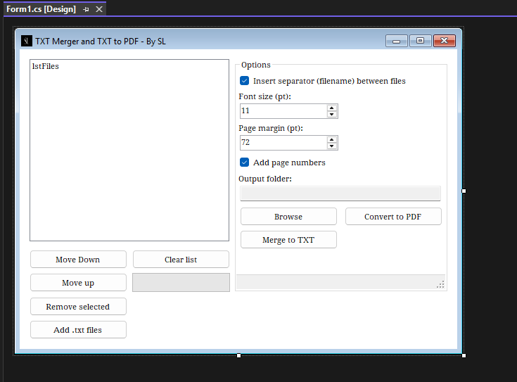

# TxtToPDF and Txt Merger
### by **Srdjan Lopez LLC**

**TxtToPDF and Txt Merger** is a modern, high-performance Windows desktop utility built with C# and WinForms.  
It allows you to quickly merge multiple `.txt` files or convert plain text documents into polished, print-ready PDF files - all with customizable formatting, font control, and smart file handling.

---

## Preview

**TxtToPDF and Txt Merger** in action:




---

## Features
- Merge multiple `.txt` files into a single document  
- Convert `.txt` to `.pdf` using [PDFsharp](https://pdfsharp.net)  
- Optional page numbers and filename separators  
- Adjustable font size and page margins  
- Choose and save to your preferred output folder  
- Drag & drop file support  
- Optimized, async-driven processing with a real-time progress bar  

---

## Tech Stack
- **Language:** C#  
- **Framework:** .NET Framework 4.8  
- **UI:** Windows Forms  
- **PDF Engine:** PDFsharp GDI  
- **IDE:** Visual Studio 2022  

---

## Getting Started

### Requirements
- Windows 10 or later (Windows 11 recommended)  
- [.NET Framework 4.8 Runtime](https://dotnet.microsoft.com/en-us/download/dotnet-framework)  

### Build Instructions
```bash
git clone https://github.com/SrdjanLopezLLC/TxtToPDF-and-TxtMerger.git
cd TxtToPDF-and-TxtMerger
```
- Open the solution in Visual Studio 2022, set configuration to Release, then Build and Run.
- The compiled executable will be located in: WindowsFormsApp1\bin\Release\

### Output Example
- Merged.txt -> Single combined file
- Merged.pdf -> Professionally formatted, page-numbered PDF

---

## Tags
txt, pdf, converter, merger, C#, .NET Framework, WinForms, PDFsharp, Srdjan Lopez LLC, text to pdf, & file merger

---

## License
This project is licensed under the Srdjan Lopez LLC Proprietary License - Non-Commercial Edition (SL-NC).

© 2025 Srdjan Lopez LLC - All Rights Reserved.
